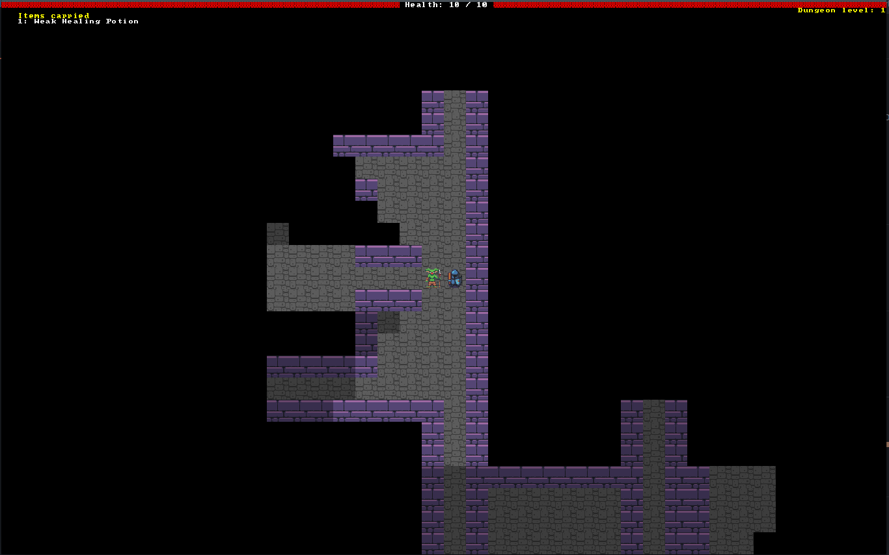

# Rusty Warrior

A simple roguelike from the tutorial book "Hands-on Rust" by Hervert Wolverson



## Building

From sources root

```
cargo run
```

Making a release build:

```
cargo build --release
```

Then copy `resources` and `target/release/rusty-warrior` to target directory